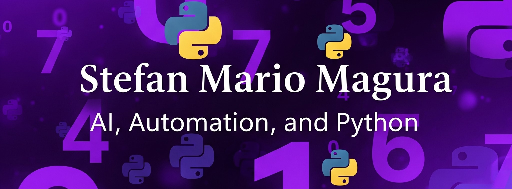

# 👋 Hi there! I'm Stefan Mario Magura

---

## 🚀 About Me: Driving Technology and Innovation

I'm a passionate student of **ASIR** (Administration of Networked Computer Systems) with a solid foundation and practical experience in the fascinating world of **automation**, **Artificial Intelligence (AI) project development**, and IT support. My true drive is solving complex real-world problems using cutting-edge technological solutions, especially through the power of **AI** and **Python automation**.

Currently, I'm gaining valuable international experience as an Erasmus+ intern at **PombalData (Portugal)**. Here, I'm developing advanced automation scripts that connect APIs, process PDF documents, and optimize workflows, directly contributing to the company's operational efficiency. A unique opportunity to expand my professional horizons! 🌍

---

## 🛠️ My Tech Stack: Tools and Skills

Here are the technologies and tools I'm most comfortable with and in which I've developed my skills:

  
  
  
  
  
  
  
  
  
  
  
  
  
  

---

## 💡 Featured Projects: Innovation in Action

Explore some of my most relevant projects, where I apply my knowledge to create functional solutions. You can access the full code in each repository:

| Project                                     | Description                                                                                                                                                                                                                               | Key Technologies                                         | Repository                                            |
| :------------------------------------------ | :---------------------------------------------------------------------------------------------------------------------------------------------------------------------------------------------------------------------------------------- | :------------------------------------------------------- | :--------------------------------------------------------------- |
| 🐾 **Image Classifier (Cats vs Dogs)** | Classifier using **TensorFlow/Keras** that distinguishes between cat and dog images. Implemented Convolutional Neural Networks (CNN) and supervised training with **Data Augmentation** techniques to improve model robustness. | Python, TensorFlow, Keras, CNN, Data Augmentation       | [View Repository](https://github.com/StefanMarioMagura/Proyecto1-IA-gatos-perros) |
| 💬 **Sentiment Analysis** | Classifier for positive and negative comments using Natural Language Processing (NLP) models. Includes **text cleaning** and data preprocessing techniques to optimize analysis accuracy.                                     | Python, NLP, Language Models, scikit-learn, Pandas   | [View Repository](https://github.com/StefanMarioMagura/Proyecto2-IA-AnalisisSentimiento) |
| 🏡 **Housing Price Prediction** | Linear regression model to estimate housing prices using the "Boston Housing" dataset. Focused on **data preprocessing**, exploratory analysis, and **visualizations** to understand relationships between variables.     | Python, scikit-learn, Pandas, Matplotlib, Seaborn        | [View Repository](https://github.com/StefanMarioMagura/Proyecto3-IA-RegresionViviendas) |
| 📊 **Python Automation for Wintouch Cloud** | Key project during my internship. Automates reading invoices in **PDF** and sending data to the **billing API**. Optimized workflows and improved operational efficiency.                        | Python, REST APIs, PDF Processing, Automation | [View Repository](https://github.com/StefanMarioMagura/PombalData-Automatizacion-Facturas-Wintouch) |

> 🔗 **Explore all my projects on my GitHub profile for more details and source code!**

---

## 📊 My GitHub Activity: Commitment and Contributions

A glimpse into my recent GitHub activity, reflecting my commitment to development and collaboration:

  
  

---

## 🌐 Languages: Communicating Without Barriers

-   **Spanish** 🇪🇸 – Native
-   **Romanian** 🇷🇴 – Native
-   **English** 🇬🇧 – Intermediate (proficient in technical documentation and professional communication)
-   **Portuguese** 🇵🇹 – Basic functional (acquired during my Erasmus+ internship)

---

## 📫 Connect With Me: Let's Talk!

I'm always open to new connections, collaboration opportunities, and tech discussions! Feel free to reach out:

-   ✉️ **Email:** [stefanmariomagura@gmail.com](mailto:stefanmariomagura@gmail.com)
-   🔗 **LinkedIn:** [linkedin.com/in/stefan-mario-magura](https://www.linkedin.com/in/stefan-mario-magura-290a26367/)
-   💼 **Currently seeking internship and employment opportunities** in software development, AI, and automation.

---

⭐ Thank you for visiting my profile! I'm excited to continue learning, applying my knowledge, and contributing to innovative projects.
